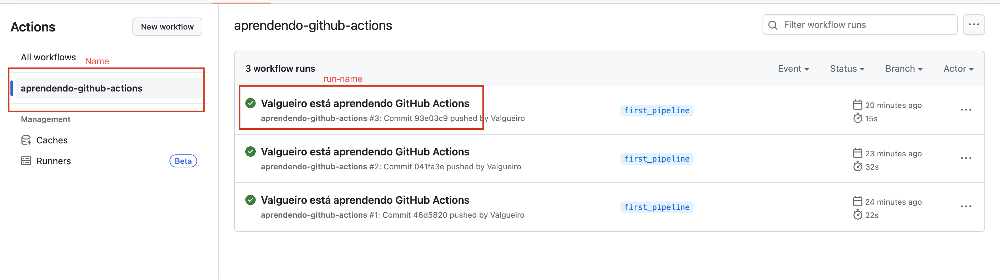

# Construindo a primeira pipeline com github actions


Utilizaremos esta pipeline:

```yaml
name: aprendendo-github-actions
run-name: ${{ github.actor }} está aprendendo GitHub Actions
on: [push]
jobs:
  check-eslint-version:
    runs-on: ubuntu-latest
    steps:
      - uses: actions/checkout@v4
      - uses: actions/setup-node@v3
        with:
          node-version: '18'
      - run: npm install -g eslint
      - run: eslint -v
```

Ela apenas dá um checkout do código, configura o node e instala o eslint. Após isso ela checa se a dependência está instalada rodando `eslint -v`.

Vamos entender o que a pipeline está definindo:

## Entendendo a pipeline

### name

```yaml
name: aprendendo-github-actions
```
É opcional, e define o nome que será mostrado na aba de "Actions" do github.

### run-name

```yaml
run-name: ${{ github.actor }} está aprendendo GitHub Actions
```
É opcional, e define o nome da "run" que serão geradas a partir dessa workflow. Será mostrado na lista de runs na aba de "Actions". Aqui utilizamos uma variável entre `{{ }}` para demonstrar esta funcionalidade.



### on

```yaml
on: [push]
```
Define os eventos que farão este workflow ser executado (triggado). Nesse caso, a ação escolhida define que a cada vez que acontecer um push no reposítório, este workflow será triggado.

### jobs:


```yaml
jobs:
  check-eslint-version: # Começa a definição do job com este nome
    runs-on: ubuntu-latest # define o runner no qual esse job deve ser rodado
```
Agrega a lista de jobs do workflow


### steps

```yaml
check-eslint-version:
    ...
        steps:
            - uses: actions/checkout@v4 # roda a v4 da action de checkout da comunidade. Basicamente faz o checkout do código.
            - uses: actions/setup-node@v3 # Roda a action da comunidade de configuraçao do node, passando uma versão específica deste
                with:
                node-version: '18'
            - run: npm install -g eslint # roda este comando no runner
            - run: eslint -v # roda este comando no runner
```

Define os passos que serão rodados pelo job. Neste caso podemos ver passos que estão utilizando `actions`da comunidade, e passos que estão rodando apenas scripts bash.

Documentação das actions utilizadas:
* [checkout](https://github.com/actions/checkout)
* [setup-node](https://github.com/actions/setup-node)
