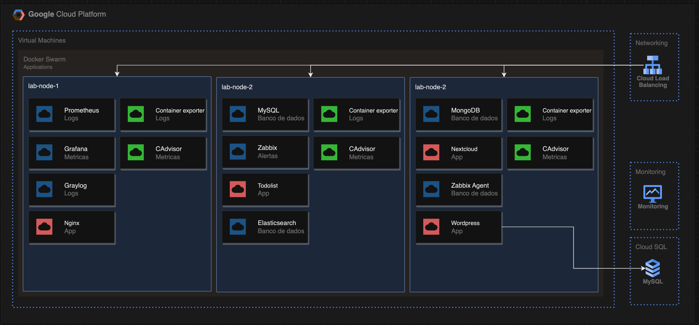
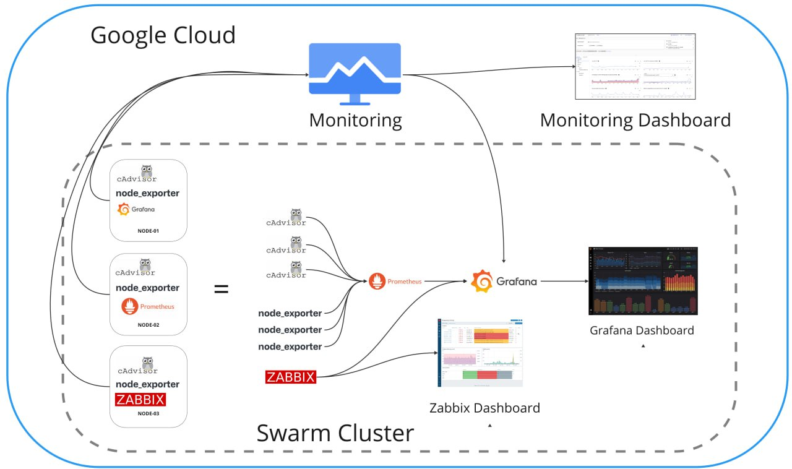

# monitoramento_e_observabilidade





Este laboratório tem como objetivo proporcionar uma experiência prática na configuração de um ambiente local composto por máquinas virtuais (VMs) utilizando o Vagrant e o Docker. O foco principal será o monitoramento dos serviços implantados em um cluster Swarm nas VMs.

## Pré-requisitos
Certifique-se de ter o [Vagrant](https://developer.hashicorp.com/vagrant/downloads?product_intent=vagrant) e um provedor de virtualização (como o [VirtualBox](https://www.virtualbox.org/wiki/Downloads)) instalados no seu sistema.


## Personalize o Vagrantfile (Opcional)
Se desejar fazer modificações na configuração da máquina virtual, edite o Vagrantfile. Você pode ajustar a memória, número de CPUs, rede e muito mais.

## Vagrant Setup

### Inicialize as Máquinas Virtuais:

No terminal, navegue até o diretório do seu projeto e execute o comando:
```bash
vagrant up
```

Depois que as VMs forem iniciadas os arquivos do repositório estarão em um volume compartilhado no diretório `/vagrant`.

### Acesso à Máquina Virtual:

Após o processo de inicialização, você pode se conectar à máquina virtual com:

```bash
vagrant ssh <nome-da-vm>
```

> Substitua o `<nome-da-vm>` pelo nome da maquina virtual que você deseja acessar, por exemplo `lab-vm1`.

### Desligue a Máquina Virtual:

Quando não for mais utilizar o lab você pode desligar as VMs com:

```bash
vagrant halt
```


### Destrua a Máquina Virtual:

Caso queira destruir o ambiente use o comando:

```bash
vagrant destroy
```


## Configurando o Ambiente

Acesse as 3 VMs e faça a instalação do Docker e o Docker Compose:

Você pode instalá-lo seguindo o guia oficial:

[Docker](https://docs.docker.com/engine/install/ubuntu/)
[Docker Compose](https://docs.docker.com/compose/install/)

Navegue até o diretório `/vagrant` onde o docker-compose.yml está localizado.

### Iniciar os Serviços:

```bash
docker-compose up -d
```
### Listar os Serviços em Execução:

```bash
docker-compose ps
```

### Ver Logs de um Serviço Específico:

```bash
docker-compose logs <nome_do_serviço>
```

### Parar os Serviços:

```bash
docker-compose down
```

### Escalonar (Scale) um Serviço Específico:

```bash
docker-compose up -d --scale <nome_do_serviço>=<número_de_instâncias>
```

### Acessar um Serviço:

Use o endereço IP e porta do serviço específico. Por exemplo, para acessar Grafana, vá para http://<endereço_ip_da_vm>:3000.

> Lembre-se de substituir <nome_do_serviço>, <número_de_instâncias>, <endereço_ip_da_vm> com os valores apropriados.

Explore os serviços configurados e adapte conforme necessário para o seu projeto.
